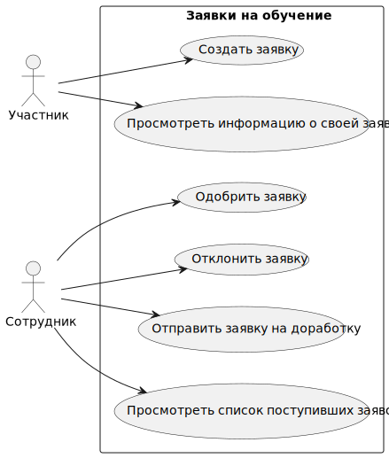

# Описание Use-Case диаграммы для системы "Заявки на обучение"

---

## Название системы:  
Система "Заявки на обучение".

### Описание системы:  
Система предназначена для подачи, обработки и управления заявками на обучение. В системе участвуют два типа пользователей: "Участник" (подает заявки) и "Сотрудник" (обрабатывает заявки). Участник может создавать и просматривать свои заявки, а сотрудник управляет их статусами, одобряет, отклоняет или отправляет на доработку.

---

## Акторы:

1. **Участник**:
   - Пользователь, который инициирует заявку на обучение. Может создавать заявку и просматривать информацию о своей заявке.

2. **Сотрудник**:
   - Пользователь, ответственный за обработку заявок на обучение. Может просматривать список поступивших заявок, а также одобрять, отклонять заявки или отправлять их на доработку.

---

## Варианты использования (Use Cases):

### 1. Создать заявку  
   - **Описание**: Участник создает новую заявку на обучение, заполняя необходимые данные.
   - **Акторы**: Участник.
   - **Предусловия**: Участник авторизован в системе и имеет право подачи заявки.
   - **Основной поток**: 
      1. Участник заполняет форму заявки.
      2. Участник подтверждает отправку заявки.
      3. Система сохраняет заявку и уведомляет участника об успешном создании.
   - **Результат**: Заявка создана и сохранена в системе.

### 2. Просмотреть информацию о своей заявке  
   - **Описание**: Участник просматривает текущий статус и детали своей заявки.
   - **Акторы**: Участник.
   - **Предусловия**: Участник создал хотя бы одну заявку.
   - **Основной поток**: 
      1. Участник выбирает заявку для просмотра.
      2. Система отображает статус и информацию о заявке.
   - **Результат**: Участник получает информацию о статусе и деталях заявки.

### 3. Просмотреть список поступивших заявок  
   - **Описание**: Сотрудник просматривает список всех поданных заявок.
   - **Акторы**: Сотрудник.
   - **Предусловия**: Сотрудник авторизован в системе.
   - **Основной поток**: 
      1. Сотрудник запрашивает список заявок.
      2. Система отображает все заявки, включая их статус.
   - **Результат**: Сотрудник получает список заявок для дальнейшей обработки.

### 4. Одобрить заявку  
   - **Описание**: Сотрудник одобряет заявку на обучение.
   - **Акторы**: Сотрудник.
   - **Предусловия**: Заявка имеет статус, допускающий её одобрение.
   - **Основной поток**: 
      1. Сотрудник выбирает заявку для одобрения.
      2. Система обновляет статус заявки на "Одобрено".
   - **Результат**: Заявка одобрена, статус обновлен.

### 5. Отклонить заявку  
   - **Описание**: Сотрудник отклоняет заявку на обучение.
   - **Акторы**: Сотрудник.
   - **Предусловия**: Заявка имеет статус, допускающий её отклонение.
   - **Основной поток**: 
      1. Сотрудник выбирает заявку для отклонения.
      2. Система обновляет статус заявки на "Отклонено" и уведомляет участника.
   - **Результат**: Заявка отклонена, статус обновлен.

### 6. Отправить заявку на доработку  
   - **Описание**: Сотрудник отправляет заявку на доработку, если в ней обнаружены ошибки или недостающая информация.
   - **Акторы**: Сотрудник.
   - **Предусловия**: Заявка имеет статус, допускающий её доработку.
   - **Основной поток**: 
      1. Сотрудник выбирает заявку и указывает причины для доработки.
      2. Система обновляет статус заявки на "На доработке" и уведомляет участника.
   - **Результат**: Заявка отправлена на доработку, статус обновлен, участник уведомлён.

---

## Связи:

- Участник инициирует вариант использования "Создать заявку" и может просматривать информацию о своей заявке.
- Сотрудник имеет доступ к просмотру списка поступивших заявок и может выполнять действия "Одобрить заявку", "Отклонить заявку" и "Отправить заявку на доработку".
- Заявки после обработки сотрудником могут переходить в разные статусы в зависимости от решения.
